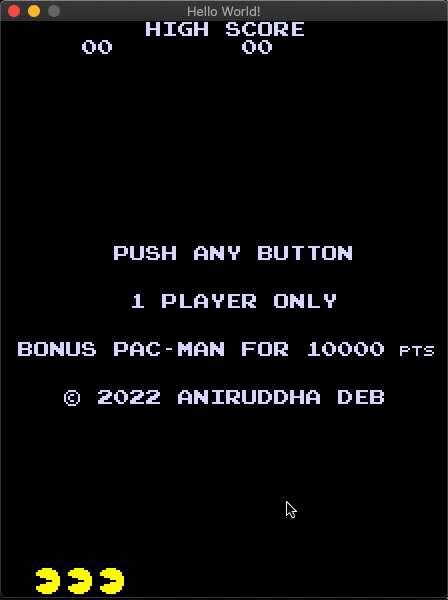

# 12h pacman

Making pacman in 12 hours. 

## The End Result

## Log

Hour 1. Setup 
- created C++ project, SDL hello world window, got pacman sprites

Hour 2-3.5. Sprites
- first sprite file was art rather than usable stuff, so tossed that out and 
  got a better file
- gridded out sprites and made defining rectangles around sprites
- rendered pacman onto the screen, alongwith animation

Hour 3.5-5. Events. Failed collision checking
- figured out scaling, transformations and some other SDL texture stuff
- Tried implementing collision checking by checking pixel value of maze. Did 
  not work out. 

Hour 5-6. Game map creation, collision detection, food and scores
- Created the game map as a text file, with food and powerups. Stored as char[][] in game
- rendered food and made scoring logic
- implemented turning logic for pacman
- implemented collision logic for pacman with game map
- saw some videos on ghost AI logic. Blinky, inky, pinky and clyde.  

Hour 7-8. Ghost AI implementation
- Ghosts can track pacman
- laid groundwork for ghost modes; ghosts spend 7 sec in scatter and 20 sec in 
  chase mode
- wraparound logic implemented for maze

Hour 9. Ghost Frightened Mode
- Ghost Frightened mode sprite rendering
- Ghost Frightened mode navigation logic
- bit of refactoring

Hour 10. Text Rendering 
- Rendered text to screen, scores, etc
- Implemented a few game modes

Hour 11-12. Gameplay mechanics refinement, game modes
- font rendering a few more characters
- added a start screen and a ready window
- added ghost eating logic, retreat back to ghost base
- split keyboard update and rendering for slower rendering but more responsive
  keyboard
- Added endgame logic but didn't have the time to follow it through with a proper
  ending sequence (even tho I have the sprites)

## TODO
Initial todo all done, yay!

Next todo's:
- Sounds
- Ending sequence, lives implement (prog just hangs on dying now)
- Prompt stage, to play again
